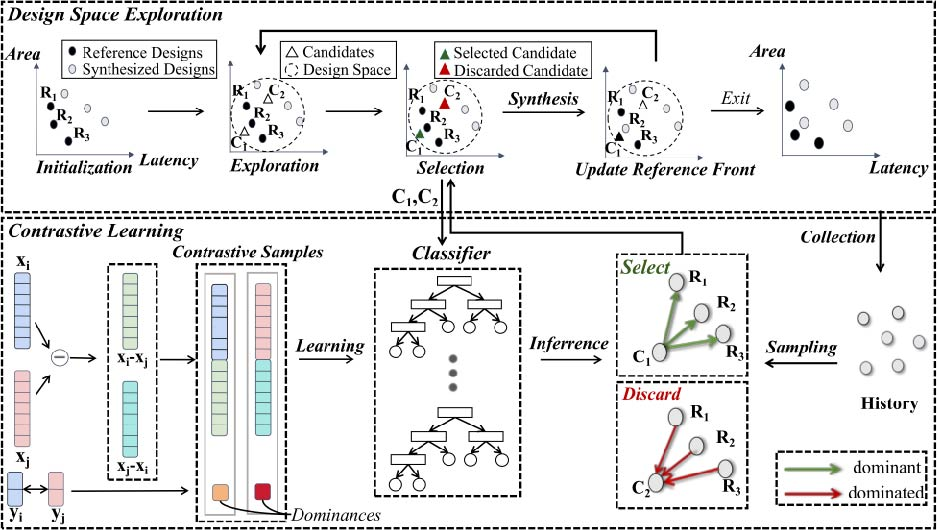

# Rethinking High-Level Synthesis Design Space Exploration from a Contrastive Perspective 
## Table of Contents
  - [About the project](#jump1)
  - [Directory Structure](#jump2)
  - [Required environment](#jump3)

## <span id="jump1">About the project</span>
This project constructs an alternative approach to identify Pareto-optimal designs by establishing a Contrastive Learning (CL) framework that determines the dominance relationship between designs based on classification methods. The CL is integrated into three state-of-the-art Design Space Exploration (DSE) approaches, namely CL-DSE (CL-Lattice,CL-Cluster, CL-e-GA), with the goal of effectively reducing the number of syntheses.


### Contribution
- We introduced a contrastive learning framework which is based on a binary classification to determine the dominance relationship between designs through pairwise comparison.
- We integrate the Contrastive Learning (CL) framework with state-of-the-art DSE approaches. Experimental results show that CL-DSE can reduce a significant amount of synthesis, while maintaining the quality of results compared to the original DSE approaches.
- Extensive experiments have been conducted to compare the accuracy of 39 regression methods and 17 classification methods for predicting the dominance relationship between designs. The results demonstrate that classification methods generally outperform regression methods.

## <span id="jump2">Directory Structure</span>
```
|-- CL-Cluster
|   `-- ClusterBasedDSE
|       |-- ADRS.m
|       |-- Assistant.py                                                            #contrastive learning framework
|       |-- Cluster.m
|       |-- ClusterBasedDSE.m                                                       #startup file
|       |-- ClusterBasedDSE.m~
|       |-- ClusterObj.m
|       |-- Contrastvie_Learning.m
|       |-- Encode.py
|       |-- ReadBenchmarks.m
|       |-- castToValidConfiguration.m
|       |-- closerSolution.m
|       |-- clusterbased_expl.m                                                      #CL-Cluster exploration
|       |-- clusterbased_expl_origin.m                                               #Cluster-Based exploration
|       |-- datasets.py
|       |-- discretizeFeature.m
|       |-- discretizeSet.m
|       |-- downgradeSolution.m
|       |-- encapsulation.m
|       |-- dbs                                                                       #db files
|       |-- explorations_results                                                      #result file save directory
|       |   |-- contrastive 
|       |   `-- origin
|       |-- explorations_results.rar                                            
|       |-- extremeFeatureSampling.m
|       |-- interclusterExploration.m
|       |-- intraclusterExploration.m
|       |-- license.txt
|       |-- paretoFrontier.m
|       |-- save_results.m
|       `-- upgradeSolution.m
|-- CL-Lattice
|   `-- Lattice-Contrastive-binary
|       |-- Assistant.py                                                              #contrastive learning framework
|       |-- Encode.py
|       |-- Lattice_Contrastive.py                                                    #Cl-Lattice DSE
|       |-- Lattice_Origin.py                                                         #Lattice DSE
|       |-- ReadDB.py
|       |-- datasets.py
|       |-- lattice_data.py
|       |-- lattice_ds_point.py
|       |-- lattice_exploration_offline.py                                            #startup file
|       |-- lattice_sphere_tree.py
|       |-- lattice_synthesis.py
|       |-- lattice_tree.py
|       |-- lattice_utils.py
|       |-- dbs                                                                       #db files
|       |-- results                                                                   #result file save directory
|       |   |-- contrastive
|       |   `-- origin    
|       |-- statistics_cluster.py                                                     #Statistical CL-Cluster and Cluster-Based results program
|       `-- statistics_lattice.py                                                     #Statistical Cl-Lattice and Lattice results program
|-- CLS-eGA   
|   `-- CLS-eGA(2)
|       `-- CLS-eGA
|           |-- Assistant.py                                                          
|           |-- EGA
|           |   |-- contrastive
|           |   `-- origin
|           |-- EGA_Contrastive.py                                                    #Cl-e-GA DSE
|           |-- EGA_Origin.py                                                         #e-GA DSE
|           |-- Encode.py
|           |-- GA_data.py
|           |-- GA_ds_point.py
|           |-- GA_exploration_offline.py                                             #startup file
|           |-- GA_sphere_tree.py
|           |-- GA_synthesis.py
|           |-- GA_tree.py
|           |-- GA_utils.py
|           |-- NSGAII.py
|           |-- ReadDB.py
|           |-- datasets.py
|           |-- results.zip
|           |-- statistics_EGA.py                                                      #Statistical CL-e-GA and e-GA results program
|           `-- statistics_utils.py
|-- Model_Evaluation
|   |-- Encode.py
|   |-- compare_regression_classification.py                                           #model evaluation on regressors and classifiers
|   |-- datasets.py
|   |-- dbs
|   |-- models_classification.py
|   |-- models_regresssion.py
|   `-- statistics_accs.py
```

## <span id="jump3">Required environment</span>

- os                        win64
- scikit-learn              1.3.2 
- python                    3.8.3
- numpy                     1.26.4
- xgboost                   2.1.1 
- lightgbm                  4.5.0 
- pymysql                   1.1.1 
- sqlite                    3.32.3
- pandas                    1.0.5
